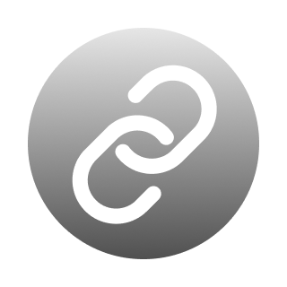

<h2 align="center"><br>Lien</h2>
<p align="center"><strong>Link Status Bar Manager for Visual Studio Code</strong></p>


&nbsp;

List of available icons can be found [here](https://code.visualstudio.com/api/references/icons-in-labels#icon-listing).


## Installation

Lien can be installed via the VS Code [Marketplace](https://marketplace.visualstudio.com/items?itemName=zigamacele.lien).

## Configuration
To configure Lien, follow these guidelines:

### Global Settings
To apply the settings globally across all your projects, add the following configuration to your user settings:

1. Open the Command Palette (Cmd+Shift+P on macOS, Ctrl+Shift+P on Windows/Linux).
2. Type: `Preferences: Open User Settings (JSON)` and select it.
3. Use `lien.user.links` to add your custom links to the settings JSON file:

```json
{
  "lien.user.links": [
    {
      "name": "Supabase", // <-- Can be left empty if you don't want a label
      "icon": "database", // <-- Can be left empty if you don't want an icon
      "link": "https://www.google.com",
      "tooltip": "Open source Firebase alternative" // <-- (Optional) Name is used as tooltip if there is no tooltip provided
    },
    {
      "name": "AdSense",
      "icon": "dashboard",
      "link": "google.com/adsense"
    }
  ]
}
```

### Project-Specific Settings
To apply the settings only to a specific project, add the configuration to the `.vscode/settings.json` file within your project directory:

1. Open your project in VS Code.
2. Create or open the `.vscode/settings.json` file in the root of your project.
3. Use `lien.workspace.links` to add your custom links to the settings JSON file:

```json
{
  "lien.workspace.links": [
    {
      "name": "Swagger", // <-- Can be left empty if you don't want a label
      "icon": "bracket", // <-- Can be left empty if you don't want an icon
      "link": "https://api.website.com/q/swagger-ui/",
    },
    {
      "name": "Locize",
      "icon": "location",
      "link": "https://www.locize.app/"
      "tooltip": "Localization management platform" // <-- (Optional) Name is used as tooltip if there is no tooltip provided
    },
    {
      "name": "Jira",
      "icon": "extensions-configure-recommended",
      "link": "https://name.atlassian.net/jira/software/c/projects/XYZ6/"
    },
    {
      "name": "Confluence",
      "icon": "output-view-icon",
      "link": "https://name.atlassian.net/wiki/spaces/XYZ6/pages/"
    },
    {
      "name": "Prod",
      "icon": "server-environment",
      "link": "https://app.website.com"
    },
    {
      "name": "Test",
      "icon": "server-environment",
      "link": "https://test.website.com"
    },
    {
      "name": "Dev",
      "icon": "server-environment",
      "link": "https://dev.website.com"
    }
  ]
}
```


## License

[MIT](./LICENSE) License © 2024 [Ziga Macele](https://github.com/zigamacele)

